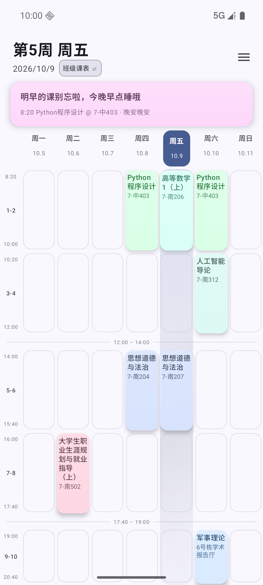
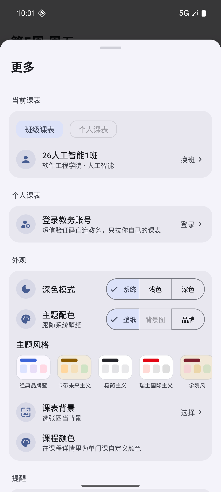
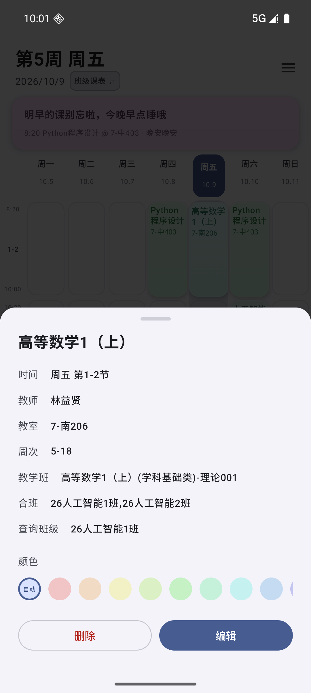

# 长工课表通

一款为长沙工业学院（CCSUT）学生打造的 Android 课表应用。原生 Kotlin + Jetpack Compose，无第三方网络库，APK 体积小、启动快、离线可用。

> 让查看课表这件事，不再那么狼狈。

<div align="center">

[](https://github.com/yi-san-spce/ccsut-kb/releases/latest)
[](LICENSE)


[](https://github.com/yi-san-spce/ccsut-kb/actions/workflows/ci.yml)

**周课表 · 今日状态 · 主题风格**





</div>

## 功能

- **班级课表**：内置全院班级课表数据集，选择班级即用，无网也能看；支持周次切换、今日状态、课程详情
- **个人课表**（可选）：用学校统一身份认证的手机号/学号 + 短信验证码登录教务系统，显示属于你一个人的完整课表——选课、重修课都会一并出现
- **本地编辑**：点空格加课、长按拖拽换课/改时间、改色、隐藏、一键还原；编辑只存在本机，学校换课后自动重套（自建课保留、修改安全丢弃并提示）
- **桌面小组件**：跟随当前生效课表（班级或个人），Material You 动态取色
- **课前提醒**：每节课开始前定时通知，可自定义提前量
- **主题**：Material You 动态取色 / 液态玻璃 / 背景图取色 / 5 套主题风格（卡带未来主义、极简主义、瑞士国际主义、学院风、赛博朋克）/ 浅色与暗色
- **更新**：应用内自动检查新版本与课表数据更新（Gitee 通道），数据集可热更、无需重装

## 下载

| 渠道 | 适合 | 入口 |
|---|---|---|
| **GitHub Releases** | 国际网络环境 | [下载最新版 APK](https://github.com/yi-san-spce/ccsut-kb/releases/latest)（附各版本说明与历史版本） |
| **Gitee 发布仓** | 国内直连（推荐） | [yisanspce/ccsut-kb-release](https://gitee.com/yisanspce/ccsut-kb-release) master 分支托管最新 APK，或取 [`latest.json`](https://gitee.com/yisanspce/ccsut-kb-release/raw/master/latest.json)（含直链与 sha256） |
| **应用内更新** | 已安装用户 | 「更多 → 检查更新」或启动时自动获取；课表数据集独立热更，无需重装 |

## 隐私与信息安全（重要）

这个应用是离线优先的本地应用，我们对你数据的态度非常明确：

- **课表数据只存在你手机上**，不上传到任何第三方服务器
- **个人课表的工作方式**：发送你收到的短信验证码登录学校教务网站，用你本人的会话只拉取你自己的课表。除学校官方系统外，**不经过、也不上报任何中间服务器**
- **验证码用完即弃**；登录会话凭据（Cookie）只保存在内存里，退出登录或杀进程即清空，**不写入手机存储**
- 本地存储仅含：课表缓存、你选的班级、（可选）用于预填的手机号/学号、昵称
- 整段登录与抓取代码全部开源（`data/CasClient.kt`、`data/PersonalRepo.kt`），技术细节见 [`docs/api-personal.md`](docs/api-personal.md)，欢迎审查

完整数据清单、权限逐条用途与删除方式见独立 [隐私政策](PRIVACY.md)。

## 构建

要求：JDK 17、Android SDK（compileSdk 37）。

```bash
git clone https://github.com/yi-san-spce/ccsut-kb.git   # 主站
# 中国区镜像: git clone https://gitee.com/yisanspce/ccsut-kb.git
cd ccsut-kb/android
./gradlew assembleDebug        # 或在 Android Studio 中直接打开 android/ 目录
./gradlew testDebugUnitTest    # 纯函数单元测试 (49 个)
./gradlew checkVersionSync     # 版本双写一致性校验 (build.gradle ↔ Updater.kt)
```

产物在 `app/build/outputs/apk/`。

发布签名：自建 `keystore/release.keystore`，口令写入 `android/local.properties` 的 `keystore.password=<你的口令>`（该文件已被 gitignore，**不要**把口令提交进仓库）。

更多开发者文档（应用架构 / 教务接口逆向 / 发版流程）见 **[文档中心 docs/README.md](docs/README.md)**。

## 质量保障

- **单元测试**：解析、周次计算、合并、编辑覆盖层等纯函数 49 个用例（`android/app/src/test/`）
- **CI**：每次推送自动跑版本双写校验 + 测试 + 构建冒烟（v2.10.3 发布事故后的制度化防线）
- **发布门禁**：`scripts/publish.sh` 拒绝在脏工作区发版，APK 版本号从产物本身读取而非配置文件

## 社区与贡献

**加入我们**（反馈与交流的首选）：

- 💬 **QQ 交流群**：`1129626080`（长工课程通社区）
- 📺 **QQ 频道**：[长沙工业学院校园论坛](https://pd.qq.com/s/9pnez0un5?b=9)（公告 / 讨论 / 抢先体验）

发现问题、有想法，也欢迎走 Issue——**已按场景分好类，点对应的入口即可，不用自己纠结怎么写**：

- 🐛 [报告 Bug](https://github.com/yi-san-spce/ccsut-kb/issues/new?template=bug_report.yml)
- 💡 [功能建议](https://github.com/yi-san-spce/ccsut-kb/issues/new?template=feature_request.yml)
- 📅 [课表数据不对](https://github.com/yi-san-spce/ccsut-kb/issues/new?template=data_issue.yml)（少课/多课/时间/教室）
- 💬 使用疑问与交流 → [Discussions](https://github.com/yi-san-spce/ccsut-kb/discussions)

想写代码？请先读 [贡献指南](CONTRIBUTING.md)（提交规范 / 版本规则 / PR 流程）。社区行为遵循 [行为准则](CODE_OF_CONDUCT.md)；安全漏洞请按 [安全政策](SECURITY.md) 私下报告，勿公开提交。

## 仓库与镜像

- **代码主站（GitHub）**：本仓库，Issue / PR 以此为准
- **更新发布主站 + 中国区镜像（Gitee）**：[yisanspce/ccsut-kb](https://gitee.com/yisanspce/ccsut-kb)——**应用内更新固定走 Gitee**（国内直连快，GitHub 打开困难也不影响升级），源码每次提交双站同步（`scripts/push.sh`），APP 内关于页/引导页均提供双通道入口

## 数据来源与更新体系

- **班级课表数据集**：从学校教务系统公开接口抓取，打包进应用并可通过更新通道热更新（无需发新版 APK）
- **发布仓** [ccsut-kb-release](https://gitee.com/yisanspce/ccsut-kb-release)：只承载分发文件（更新清单 / 数据包 / APK），`scripts/publish.sh` 一条龙发布（含自动打 tag 与 GitHub Release）
- 教务登录链路、接口语义与网关行为的技术文档见 [`docs/api.md`](docs/api.md) 与 [`docs/api-personal.md`](docs/api-personal.md)

## License

[GPL-3.0](LICENSE)。以源码形式二次分发请保持同协议开源；分发 APK 时请按协议提供对应源码获取途径（本仓库 GitHub / Gitee 地址即可）。
